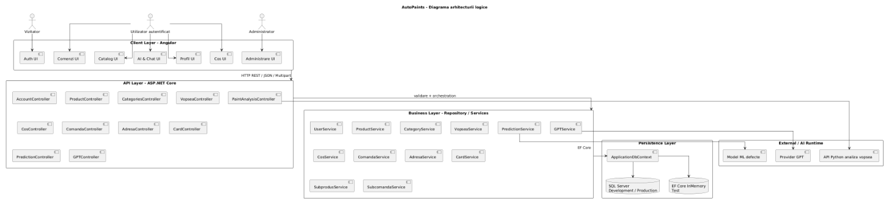
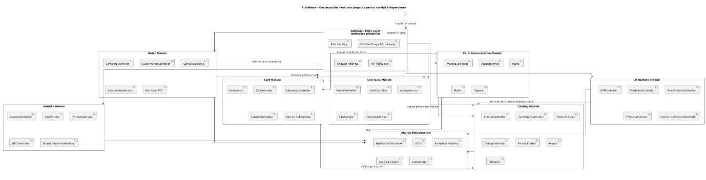
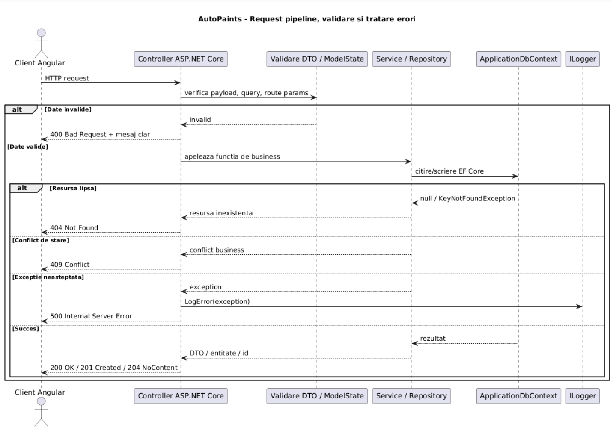
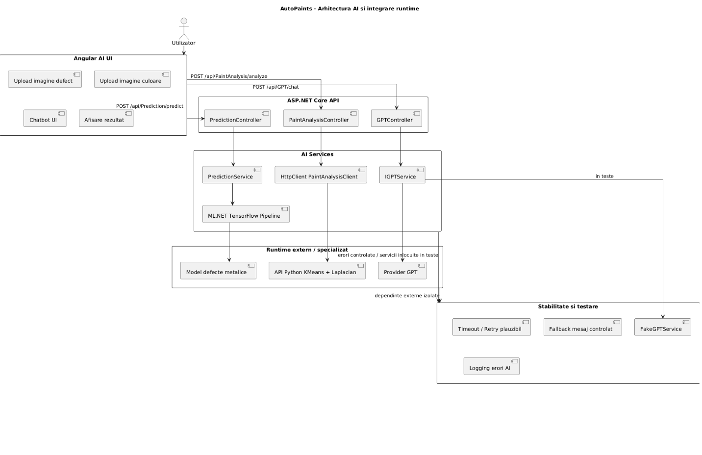
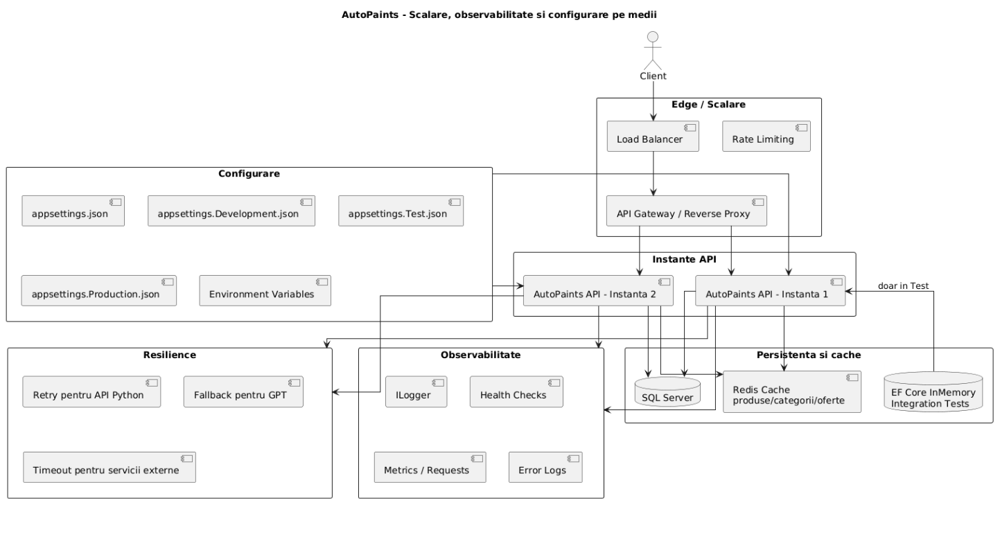
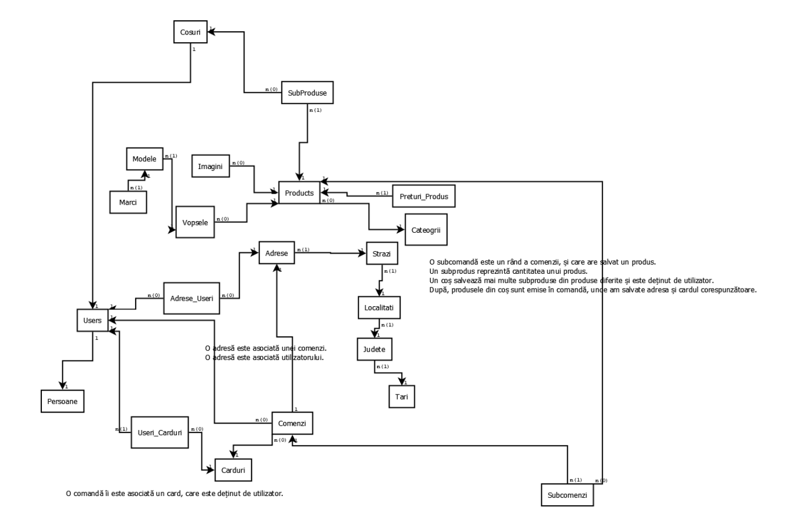
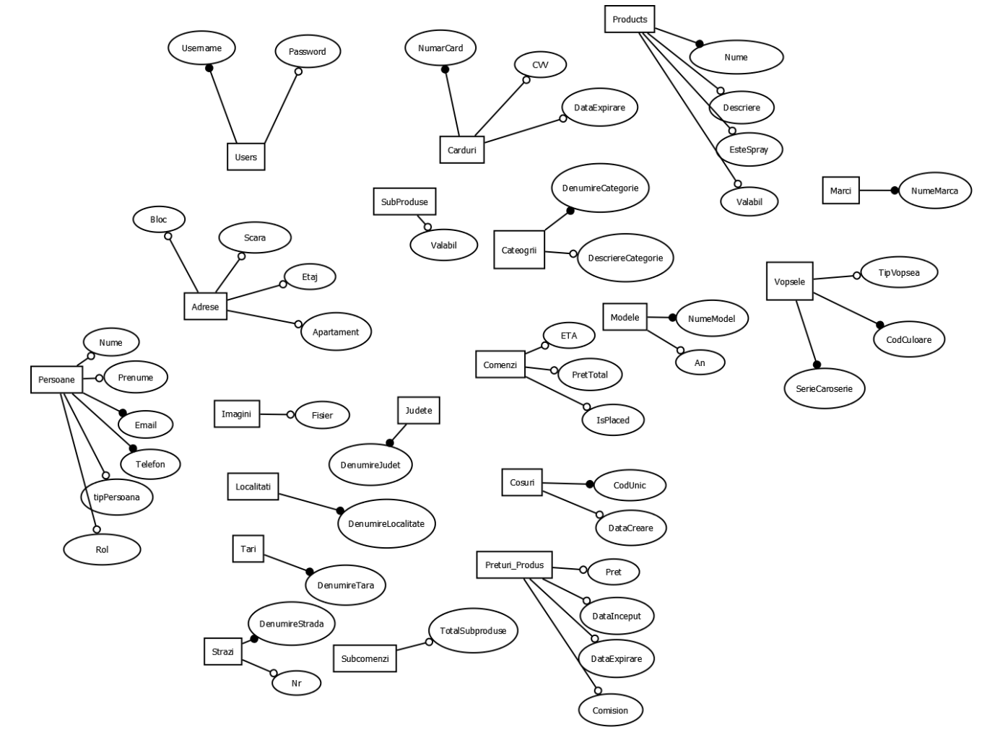
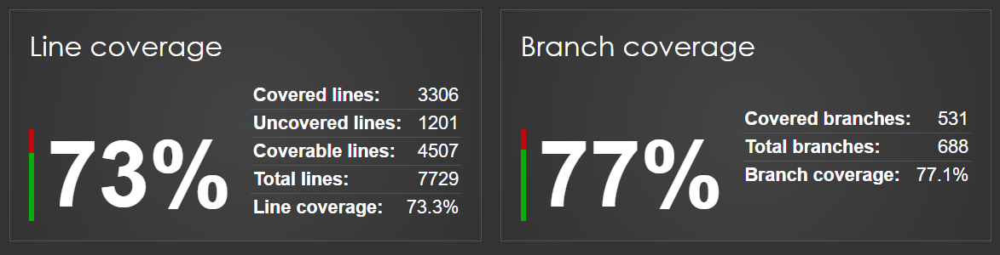

# AutoPaints – AWBD Proiect

---

## 1. Descriere generala

**AutoPaints** este o aplicatie web de tip e-commerce pentru comercializarea de vopsele auto, spray-uri, produse auxiliare si produse personalizate pe baza codului de culoare al masinii. Aplicatia combina functionalitati clasice de magazin online cu module AI pentru analiza imaginilor, detectarea defectelor de vopsea, identificarea culorii dominante si determinarea caracterului metalizat al vopselei.

Scopul proiectului este sa ofere un flux complet pentru utilizator: autentificare, cautare produse, adaugare in cos, selectare adresa/card, emitere comanda, istoric comenzi si functionalitati AI care ajuta utilizatorul sa aleaga produsul potrivit. Pentru administrator, aplicatia ofera functionalitati de gestiune a produselor, categoriilor, preturilor, reducerilor, comenzilor si utilizatorilor.

---

## 2. Obiectivele aplicatiei

- Oferirea unei platforme online specializate pentru achizitionarea de vopsele auto, spray-uri si produse auxiliare, adaptata nevoilor clientilor care cauta rapid produse potrivite pentru masina lor.
- Simplificarea procesului de identificare si cumparare a vopselei auto potrivite, inclusiv pentru produse personalizate pe baza codului de culoare, marcii, modelului si anului masinii.
- Crearea unei alternative moderne la magazinele clasice de vopsele auto, printr-un flux digital complet: cautare produs, adaugare in cos, selectare adresa/card si emitere comanda.
- Sprijinirea clientilor in alegerea produsului corect prin functionalitati AI de analiza a imaginilor, detectare a defectelor de vopsea si identificare a caracterului metalizat al vopselei.
- Reducerea timpului necesar pentru gasirea produselor potrivite, prin filtrare pe categorii, cautare rapida si afisarea clara a informatiilor despre produse, preturi si disponibilitate.
- Oferirea unei experiente intuitive atat pentru clienti, cat si pentru administratori, printr-o interfata web moderna, formulare clare, validari si mesaje usor de inteles.
- Digitalizarea procesului de gestionare a comenzilor, produselor, categoriilor, adreselor si cardurilor, astfel incat administrarea magazinului sa fie mai eficienta si mai usor de controlat.
- Cresterea increderii utilizatorilor printr-un sistem care gestioneaza datele, comenzile si erorile intr-un mod clar, sigur si predictibil.
- Punerea pe piata a unei solutii e-commerce de nisa, orientata catre domeniul auto, care combina vanzarea de produse cu asistenta digitala si functionalitati inteligente.

---

## 3. Tehnologii utilizate

| Componenta              | Tehnologii                                            |
| ----------------------- | ----------------------------------------------------- |
| Frontend                | Angular, TypeScript, HTML, CSS                        |
| Backend                 | ASP.NET Core / .NET 9, C#                             |
| Persistenta             | Entity Framework Core                                 |
| Baza de date dezvoltare | Microsoft SQL Server                                  |
| Baza de date testare    | EF Core InMemory / configuratie separata pentru teste |
| Autentificare           | JWT Bearer Tokens                                     |
| Securizare parole       | BCrypt                                                |
| Testare                 | NUnit, Moq, FluentAssertions, Coverlet                |
| Coverage                | coverlet.msbuild + ReportGenerator                    |
| AI defecte              | Model ML/Keras integrat prin serviciu de predictie    |
| AI analiza vopsea       | API Python apelat din backend prin HttpClient         |
| PDF / bon fiscal        | QuestPDF                                              |
| Logging                 | ILogger integrat in ASP.NET Core                      |

---

## 4. Diagrame UML si arhitectura aplicatiei

Diagramele de mai jos vizeaza structura aplicatiei si arhitectura tehnica: separarea pe layere, module functionale, integrarea AI, fluxul request-urilor, configurarea pe medii, scalarea si observabilitatea. Ele nu repeta diagrama ERD, ci arata cum componentele aplicatiei colaboreaza la nivel de sistem.

Aplicatia este construita pe o arhitectura web stratificata, in care frontend-ul Angular comunica prin HTTP cu API-ul ASP.NET Core, iar backend-ul este organizat pe controllere, repository-uri/servicii si persistenta EF Core peste SQL Server. Peste nucleul de e-commerce sunt integrate si componente AI specializate: serviciul Python Flask pentru analiza vopselei, serviciul ML.NET / TensorFlow pentru predictia defectelor metalice si serviciul Gemini pentru chatbot-ul inteligent.

Backend-ul expune endpoint-uri REST prin controllere ASP.NET Core. Controllerele valideaza input-ul, returneaza coduri HTTP corespunzatoare si trimit logica mai departe catre repository-uri sau servicii specializate. Pentru entitatile principale se foloseste repository pattern, iar operatiile complexe, precum emiterea comenzilor sau crearea unei vopsele personalizate, includ logica de business suplimentara.

Frontend-ul Angular gestioneaza paginile de autentificare, inregistrare, profil, catalog, cos, comenzi, istoric, administrare, AI si chatbot. Aplicatia utilizeaza servicii Angular pentru comunicarea cu API-ul backend si pentru persistarea sesiunii prin token JWT.

Modelul de date este relational si include peste 6-7 entitati interconectate. Printre entitatile principale se regasesc `User`, `Persoana`, `Adresa`, `Carduri`, `Cos`, `Produs`, `Categorii`, `Preturi_Produs`, `Subprodus`, `Comanda`, `Subcomanda`, `Vopsea`, `Marca`, `Model`, `Imagini`, `Tari`, `Judete`, `Localitati` si `Strazi`.

### 4.1 Diagrama arhitecturii logice a aplicatiei

### 4.2 Diagrama de decompozitie modulara pregatita pentru servicii independente

### 4.3 Diagrama fluxului de request si tratare a erorilor

### 4.4 Diagrama arhitecturii AI si servicii externe

### 4.5 Diagrama scalarii, configurarii si observabilitatii

---

## 5. Diagrama ERD, controllere, servicii si operatii CRUD

Aceasta sectiune documenteaza modelul relational al aplicatiei AutoPaints si modul in care acesta este folosit in backend prin controllere, repository-uri si servicii. Punctul acopera si cerinta legata de **Operatii CRUD Complete**, deoarece entitatile principale ale aplicatiei sunt gestionate prin endpoint-uri REST, servicii dedicate si metode de acces la baza de date folosind Entity Framework Core.

### Schema completa

### Entitati

Modelul de date este construit in jurul unui flux complet de e-commerce pentru vopsele auto: utilizatori, date personale, adrese, carduri, produse, categorii, preturi, vopsele, cosuri, comenzi si subcomenzi. Diagrama ERD evidentiaza faptul ca aplicatia nu foloseste entitati izolate, ci un model relational extins, in care fiecare functionalitate importanta are persistenta proprie.

Printre entitatile principale se regasesc:

- `User`
- `Persoana`
- `Adresa`
- `Carduri`
- `Cos`
- `Produs`
- `Categorii`
- `Preturi_Produs`
- `Subprodus`
- `Comanda`
- `Subcomanda`
- `Vopsea`
- `Marca`
- `Model`
- `Imagini`
- `Tari`
- `Judete`
- `Localitati`
- `Strazi`

Aceste entitati sustin functionalitatile principale ale aplicatiei: autentificare, profil utilizator, catalog de produse, cos de cumparaturi, emitere comenzi, istoric comenzi, produse personalizate, adrese, carduri si module AI.

### Relatii principale din modelul de date

- **One-to-One**
  - `User` -> `Persoana`: un cont de utilizator este asociat cu o singura inregistrare de date personale.
  - `User` -> `Cos`: un utilizator are un cos activ asociat, folosit pentru retinerea produselor selectate inainte de emiterea comenzii.

- **One-to-Many / Many-to-One**
  - `Categorii` -> `Produs`: o categorie poate contine mai multe produse, iar fiecare produs apartine unei categorii.
  - `Produs` -> `Preturi_Produs`: un produs poate avea mai multe preturi salvate istoric, inclusiv preturi active si reduceri.
  - `Produs` -> `Subprodus`: un produs este reprezentat prin mai multe unitati individuale de stoc.
  - `Cos` -> `Subprodus`: un cos poate contine mai multe subproduse, iar un subprodus poate fi atasat unui cos sau poate ramane disponibil in stoc.
  - `Comanda` -> `Subcomanda`: o comanda contine mai multe linii de comanda, iar fiecare subcomanda retine produsul si cantitatea comandata.
  - `Tari` -> `Judete` -> `Localitati` -> `Strazi` -> `Adresa`: localizarea este normalizata pe mai multe niveluri, astfel incat adresele sa fie legate de strada, localitate, judet si tara.
  - `Marca` -> `Model` -> `Vopsea`: o marca poate avea mai multe modele, iar vopseaua personalizata este legata de modelul masinii si de produsul creat automat.

- **Many-to-Many**
  - `User` <-> `Adresa`, prin tabela de legatura `Adrese_Useri`: un utilizator poate avea mai multe adrese salvate, iar o adresa poate fi asociata mai multor utilizatori daca este reutilizata.
  - `User` <-> `Carduri`, prin tabela de legatura `Useri_Carduri`: un utilizator poate avea mai multe carduri, iar relatia pastreaza si data adaugarii cardului.

Aceste relatii permit reutilizarea datelor, reduc duplicarea si sustin fluxurile reale ale aplicatiei: salvarea adreselor, asocierea cardurilor, gestionarea cosului, emiterea comenzilor si generarea istoricului.

### Controllere REST

Backend-ul expune functionalitatile aplicatiei prin controllere ASP.NET Core. Controllerele primesc request-urile HTTP din frontend, valideaza datele primite, apeleaza serviciile/repository-urile corespunzatoare si returneaza raspunsuri HTTP clare.

Principalele controllere folosite in aplicatie sunt:

| Controller                | Rol in aplicatie                                                                                                   |
| ------------------------- | ------------------------------------------------------------------------------------------------------------------ |
| `AccountController`       | Gestioneaza autentificarea, inregistrarea, actualizarea contului, schimbarea parolei, rolurile si token-ul JWT.    |
| `AdresaController`        | Gestioneaza crearea, citirea, actualizarea, stergerea si asocierea adreselor cu utilizatorii.                      |
| `CardController`          | Gestioneaza cardurile utilizatorilor, asocierea cardurilor si criptarea datelor sensibile prin service.            |
| `CategoriesController`    | Expune operatii CRUD pentru categoriile de produse.                                                                |
| `ComandaController`       | Gestioneaza emiterea comenzilor, afisarea istoricului, marcarea comenzilor ca livrate si generarea bonului fiscal. |
| `CosController`           | Gestioneaza cosul de cumparaturi, produsele din cos si modificarea cantitatilor.                                   |
| `ProductController`       | Expune operatii pentru produse: listare, cautare, filtrare, creare, actualizare, dezactivare, stergere si preturi. |
| `SubprodusController`     | Gestioneaza unitatile individuale de stoc asociate produselor si cosurilor.                                        |
| `SubcomandaController`    | Gestioneaza liniile de comanda asociate comenzilor.                                                                |
| `PersoanaController`      | Gestioneaza datele personale ale utilizatorilor si operatii asociate profilului.                                   |
| `VopseaController`        | Gestioneaza fluxul de creare a vopselelor personalizate si adaugarea acestora in cos.                              |
| `PredictionController`    | Expune endpoint-ul pentru detectarea defectelor metalice din imagini.                                              |
| `PaintAnalysisController` | Trimite imaginile catre API-ul Python pentru culoare dominanta si detectare vopsea metalizata.                     |
| `GPTController`           | Expune chatbot-ul aplicatiei prin servicii AI externe.                                                             |
| `PaginationController`    | Expune endpoint-uri pentru paginarea si filtrarea produselor.                                                      |

Prin aceasta organizare, controllerul nu concentreaza toata logica aplicatiei, ci functioneaza ca strat de intrare HTTP. Logica efectiva este mutata in service layer si repository-uri, ceea ce respecta separarea responsabilitatilor.

### Servicii si repository-uri

Aplicatia foloseste servicii si repository-uri pentru separarea logicii de business fata de controllere. Entity Framework Core este folosit pentru persistenta si interogarea bazei de date, iar serviciile/repository-urile contin metodele concrete pentru operatii CRUD, validari, asocierea entitatilor si logica de business.

Cele 15 servicii principale mentionate in proiect sunt:

| Serviciu            | Interfata / repository  | Rol principal                                                                                             |
| ------------------- | ----------------------- | --------------------------------------------------------------------------------------------------------- |
| `UserService`       | `IUserRepository`       | Gestioneaza utilizatorii, autentificarea, inregistrarea, parolele, rolurile si token-urile JWT.           |
| `PersoanaService`   | `IPersoanaRepository`   | Gestioneaza datele personale ale utilizatorilor: creare, citire, actualizare si stergere.                 |
| `AdresaService`     | `IAdresaRepository`     | Gestioneaza adresele, ierarhia tara-judet-localitate-strada si asocierea adreselor cu utilizatorii.       |
| `CardService`       | `ICardRepository`       | Gestioneaza cardurile, asocierea lor cu utilizatorii si criptarea datelor sensibile.                      |
| `CategoryService`   | `ICategoryRepository`   | Gestioneaza operatiile CRUD pentru categoriile de produse.                                                |
| `ProductService`    | `IProductRepository`    | Gestioneaza produsele, cautarea, filtrarea, preturile, reducerile, imaginile si DTO-urile pentru afisare. |
| `CosService`        | `ICosRepository`        | Gestioneaza cosurile utilizatorilor, produsele din cos si modificarea cantitatilor.                       |
| `ComandaService`    | `IComandaRepository`    | Gestioneaza comenzile, emiterea comenzilor, calculul totalului, statusul de livrare si bonul fiscal.      |
| `SubcomandaService` | `ISubcomandaRepository` | Gestioneaza liniile de comanda si produsele asociate unei comenzi.                                        |
| `SubprodusService`  | `ISubprodusRepository`  | Gestioneaza unitatile individuale de stoc si asocierea lor cu produse sau cosuri.                         |
| `VopseaService`     | `IVopseaRepository`     | Gestioneaza crearea vopselelor personalizate, marca, modelul, codul de culoare si cantitatea.             |
| `PredictionService` | `IPredictionService`    | Gestioneaza detectarea defectelor metalice folosind modelul ML integrat.                                  |
| `AimlApiService`    | `IGPTService`           | Gestioneaza comunicarea cu AIML API pentru raspunsuri de tip chatbot.                                     |
| `GeminiService`     | `IGPTService`           | Gestioneaza comunicarea cu Gemini pentru functionalitatea de chatbot.                                     |
| `OpenAIService`     | `IGPTService`           | Reprezinta o implementare alternativa pentru comunicarea cu OpenAI, pastrata in proiect ca serviciu AI.   |

Aceasta separare permite testarea individuala a logicii de business si pastreaza controllerele mai curate. De exemplu, `ProductService` gestioneaza operatiile de cautare si filtrare a produselor, `ComandaService` calculeaza totalul comenzii si creeaza subcomenzi, `AdresaService` construieste adresele normalizate, iar `CardService` cripteaza datele cardurilor inainte de salvare.

### Operatii CRUD Complete

Cerinta evaluata:

**2. Operatii CRUD Complete**

Cerintele acestei sectiuni sunt acoperite astfel:

| Cerinta                                      | Implementare in AutoPaints                                                                                                                                                                                                                                                        |
| -------------------------------------------- | --------------------------------------------------------------------------------------------------------------------------------------------------------------------------------------------------------------------------------------------------------------------------------- |
| Create, Read, Update, Delete pentru entitati | Entitatile principale sunt gestionate prin endpoint-uri REST si metode dedicate in service/repository. Exemple: produse, categorii, utilizatori, persoane, adrese, carduri, cosuri, comenzi, subcomenzi, subproduse si vopsele.                                                   |
| Repository pattern                           | Aplicatia foloseste interfete repository precum `IProductRepository`, `ICategoryRepository`, `IComandaRepository`, `ICosRepository`, `ICardRepository`, `IAdresaRepository`, `IPersoanaRepository`, `ISubprodusRepository`, `ISubcomandaRepository`, `IUserRepository` si altele. |
| Entity Framework Core                        | Folosit prin `ApplicationDbContext`, `DbSet-uri`, LINQ si metode asincrone precum `ToListAsync`, `FindAsync`, `FirstOrDefaultAsync` si `SaveChangesAsync`.                                                                                                                        |
| Service layer cu logica de business          | Logica nu este pastrata doar in controllere, ci este mutata in servicii precum `ProductService`, `ComandaService`, `CardService`, `AdresaService`, `CosService`, `VopseaService`, `PredictionService` si serviciile AI.                                                           |
| Exception handling specific                  | Aplicatia returneaza raspunsuri diferite pentru date invalide, resurse inexistente, conflicte de business, autentificare esuata si erori interne.                                                                                                                                 |

Operatiile CRUD sunt implementate la nivelul entitatilor principale:

| Entitate / zona            | Create | Read | Update |                                         Delete |
| -------------------------- | -----: | ---: | -----: | ---------------------------------------------: |
| Utilizatori / conturi      |     Da |   Da |     Da |                                             Da |
| Persoane                   |     Da |   Da |     Da |                                             Da |
| Produse                    |     Da |   Da |     Da |                                             Da |
| Categorii                  |     Da |   Da |     Da |                                             Da |
| Adrese                     |     Da |   Da |     Da |                                             Da |
| Carduri                    |     Da |   Da |     Da |                                             Da |
| Cosuri                     |     Da |   Da |     Da |                                             Da |
| Subproduse                 |     Da |   Da |     Da |                                             Da |
| Comenzi                    |     Da |   Da |     Da |                                             Da |
| Subcomenzi                 |     Da |   Da |     Da |                                             Da |
| Vopsele personalizate      |     Da |   Da |     Da |                                             Da |
| Preturi produse / reduceri |     Da |   Da |     Da |                                             Da |
| Marci si modele            |     Da |   Da |     Da | Gestionate prin fluxul de vopsea personalizata |
| Imagini produse            |     Da |   Da |     Da |              Gestionate prin fluxul produselor |
| Entitati de localizare     |     Da |   Da |     Da |               Gestionate prin fluxul adreselor |

Pentru unele entitati suport, precum `Tari`, `Judete`, `Localitati`, `Strazi`, `Marca` si `Model`, operatiile nu sunt neaparat expuse ca un CRUD administrativ separat in frontend, ci sunt gestionate in interiorul fluxurilor de business. De exemplu, la crearea unei adrese, sistemul verifica daca tara, judetul, localitatea si strada exista deja, iar daca nu exista, le creeaza automat. Similar, in fluxul de vopsea personalizata, marca si modelul pot fi create sau reutilizate in functie de datele introduse.

### Exemple concrete de CRUD in aplicatie

#### Produse

Produsele pot fi create, afisate, cautate, filtrate, actualizate, dezactivate si sterse. `ProductService` gestioneaza metode precum listarea tuturor produselor, cautarea dupa nume, filtrarea dupa categorie, obtinerea produselor dupa utilizator, crearea unui produs, actualizarea produsului si stergerea acestuia. In plus, serviciul gestioneaza DTO-uri complexe pentru afisarea produselor cu pret, imagine, categorie, disponibilitate si vendor.

#### Categorii

Categoriile sunt gestionate prin `CategoryService`, care include metode pentru obtinerea tuturor categoriilor, obtinerea unei categorii dupa ID, adaugarea unei categorii, actualizarea acesteia si stergerea ei. In plus, sunt tratate situatiile in care categoria nu exista sau datele trimise sunt invalide.

#### Adrese

Adresele sunt gestionate prin `AdresaService`. La creare, serviciul nu salveaza doar adresa simpla, ci construieste intreaga structura de localizare: tara, judet, localitate, strada si apoi adresa propriu-zisa. Dupa creare, adresa este asociata utilizatorului. Serviciul permite si citirea, actualizarea, stergerea si dezatasarea adreselor.

#### Carduri

Cardurile sunt gestionate prin `CardService`. Serviciul permite crearea cardurilor, citirea lor, actualizarea, stergerea, asocierea cu un utilizator si dezatasarea de la utilizator. Datele sensibile precum numarul cardului si CVV-ul sunt criptate inainte de salvare si decriptate doar cand sunt citite pentru afisare controlata.

#### Cosuri

Cosul de cumparaturi este gestionat prin `CosService`. Serviciul permite crearea sau verificarea cosului unui utilizator, obtinerea produselor din cos, modificarea cantitatilor, golirea cosului si stergerea cosurilor vechi. Acesta este un exemplu de CRUD extins cu logica de business specifica domeniului.

#### Comenzi si subcomenzi

Comenzile sunt gestionate prin `ComandaService`, iar liniile de comanda prin `SubcomandaService`. La emiterea unei comenzi, sistemul citeste produsele din cos, grupeaza subprodusele dupa produs, calculeaza totalul, creeaza comanda si genereaza subcomenzile. In plus, permite afisarea istoricului comenzilor, marcarea unei comenzi ca livrate si generarea bonului fiscal PDF.

#### Subproduse

`SubprodusService` gestioneaza unitatile individuale de stoc. Acest nivel este important deoarece produsul reprezinta articolul general, iar subprodusul reprezinta o unitate concreta disponibila in stoc sau atasata temporar unui cos.

#### Vopsele personalizate

`VopseaService` gestioneaza fluxul prin care utilizatorul poate crea o vopsea personalizata pe baza marcii, modelului, anului, seriei de caroserie, codului de culoare, tipului de vopsea si cantitatii. Acest flux combina mai multe entitati: categorie, produs, pret, marca, model, vopsea si subproduse.

### Exception handling specific pentru operatii

Aplicatia trateaza erorile in functie de tipul operatiei si de cauza problemei:

| Tip eroare           |                  Cod HTTP | Exemplu in aplicatie                                                                                 |
| -------------------- | ------------------------: | ---------------------------------------------------------------------------------------------------- |
| Date invalide        |           400 Bad Request | DTO null, campuri lipsa, categorie invalida, request gresit.                                         |
| Autentificare esuata |          401 Unauthorized | Username/parola gresite sau parola veche incorecta.                                                  |
| Resursa inexistenta  |             404 Not Found | Produs, categorie, adresa, card, cos sau comanda inexistenta.                                        |
| Conflict de business |              409 Conflict | Utilizatorul are deja un cos sau o relatie exista deja.                                              |
| Eroare interna       | 500 Internal Server Error | Eroare la baza de date, eroare la generarea PDF-ului, eroare la serviciile externe sau la predictie. |

Exemple concrete:

- `CardService` arunca `KeyNotFoundException` cand se incearca actualizarea, stergerea sau dezatasarea unui card inexistent.
- `AdresaService` verifica existenta userului si a adresei inainte de asociere.
- `ComandaService` opreste emiterea comenzii daca utilizatorul nu are cos sau daca acesta este gol.
- `ProductService` returneaza raspunsuri specifice daca produsul, categoria sau lista cautata nu exista.
- `PredictionService` trateaza separat erorile de preprocesare a imaginii si erorile aparute la predictie.
- Serviciile AI (`AimlApiService`, `GeminiService`, `OpenAIService`) trateaza erorile de comunicare cu API-uri externe prin exceptii HTTP controlate.

Prin acest mecanism, frontend-ul Angular poate afisa mesaje clare pentru utilizator, iar backend-ul ramane organizat si usor de testat.

---

## 6. Cerinte functionale implementate

Cerintele functionale de mai jos descriu functionalitati concrete existente in aplicatie, nu doar directii generale. Ele sunt corelate cu modulele backend si cu endpoint-urile documentate in sectiunea API.

| ID    | Actor                    | Cerinta functionala                                                                                                                          | Implementare in aplicatie                                                                                                                                                         |
| ----- | ------------------------ | -------------------------------------------------------------------------------------------------------------------------------------------- | --------------------------------------------------------------------------------------------------------------------------------------------------------------------------------- |
| CF-01 | Vizitator                | Sistemul trebuie sa permita crearea unui cont nou pe baza unui username, parola si date personale.                                           | `POST api/Account/Register`, cu validare pentru email, parola, username duplicat si rol.                                                                                          |
| CF-02 | Utilizator               | Sistemul trebuie sa permita autentificarea utilizatorului si returnarea unui token de sesiune.                                               | `POST api/Account/Login`, cu verificare BCrypt si generare JWT.                                                                                                                   |
| CF-03 | Utilizator               | Sistemul trebuie sa permita modificarea datelor personale si schimbarea parolei.                                                             | `PUT api/Account/Update/{id}`, `PUT api/Account/update-detalii/{idUser}`, `PUT api/Account/ChangePasswordWithOld/{id}`.                                                           |
| CF-04 | Administrator            | Sistemul trebuie sa permita modificarea rolului unui utilizator.                                                                             | `PUT api/Account/update-rol/{id}`, cu roluri permise: `Owner`, `Administrator`, `Participant`.                                                                                    |
| CF-05 | Utilizator               | Sistemul trebuie sa afiseze catalogul de produse disponibile.                                                                                | `GET api/Product`, `GET api/Product/detailed`, `GET api/Product/offer`.                                                                                                           |
| CF-06 | Utilizator               | Sistemul trebuie sa permita cautarea si filtrarea produselor.                                                                                | `GET api/Product/search`, `GET api/Product/category/{category}`, `GET api/Product/categories`.                                                                                    |
| CF-07 | Administrator / vanzator | Sistemul trebuie sa permita adaugarea unui produs cu date de baza, categorie, pret si imagine.                                               | `POST api/Product`, cu `multipart/form-data` si salvarea imaginii in tabela `Imagini`.                                                                                            |
| CF-08 | Administrator            | Sistemul trebuie sa permita actualizarea, dezactivarea, stergerea produselor si modificarea preturilor.                                      | `PUT api/Product/{id}`, `PUT api/Product/admin-update/{idProdus}`, `PUT api/Product/dezactiveaza/{idProdus}`, `DELETE api/Product/{id}`, endpoint-uri pentru preturi si reduceri. |
| CF-09 | Administrator            | Sistemul trebuie sa permita gestionarea categoriilor de produse.                                                                             | `GET/POST/PUT/DELETE api/Categories`.                                                                                                                                             |
| CF-10 | Utilizator               | Sistemul trebuie sa permita crearea unei vopsele personalizate dupa marca, model, an, serie caroserie, cod culoare, tip vopsea si cantitate. | `POST api/Vopsea/creare-si-adauga-in-cos`; fluxul creeaza/reutilizeaza cosul, categoria, produsul, pretul, marca, modelul, vopseaua si subprodusele.                              |
| CF-11 | Utilizator               | Sistemul trebuie sa permita crearea, actualizarea, stergerea si selectarea adreselor salvate.                                                | `POST api/Adresa/createForUser/{userId}`, `PUT api/Adresa/update/{id}`, `DELETE api/Adresa/delete/{id}`, `GET api/Adresa/user/{userId}`.                                          |
| CF-12 | Utilizator               | Sistemul trebuie sa permita salvarea si asocierea cardurilor cu utilizatorul.                                                                | `POST api/Card/create`, `POST api/Card/assign`, `GET api/Card/user/{userId}`, cu criptarea numarului de card si a CVV-ului in service.                                            |
| CF-13 | Utilizator               | Sistemul trebuie sa permita vizualizarea cosului si modificarea cantitatilor.                                                                | `GET api/Cos/cart-details/{userId}`, `PUT api/Cos/add-one`, `PUT api/Cos/remove-one`, `PUT api/Cos/remove-all`.                                                                   |
| CF-14 | Utilizator               | Sistemul trebuie sa permita emiterea unei comenzi pe baza produselor din cos.                                                                | `POST api/comanda/emitere` pentru card si `POST api/comanda/emitere-cash` pentru plata cash.                                                                                      |
| CF-15 | Sistem                   | Sistemul trebuie sa transforme produsele din cos in subcomenzi si sa calculeze totalul comenzii.                                             | `ComandaService.EmitereComanda` grupeaza subprodusele pe produs, calculeaza pretul total si creeaza liniile de comanda.                                                           |
| CF-16 | Administrator            | Sistemul trebuie sa permita actualizarea statusului de livrare al unei comenzi.                                                              | `PUT api/comanda/livrare/{id}`.                                                                                                                                                   |
| CF-17 | Utilizator               | Sistemul trebuie sa permita vizualizarea istoricului comenzilor si a produselor comandate.                                                   | `GET api/comanda/afisare/{userId}`, `GET api/comanda/scurt/user/{userId}`, `GET api/Subcomanda/by-comanda/{idComanda}`.                                                           |
| CF-18 | Utilizator               | Sistemul trebuie sa permita generarea sau descarcarea unui bon fiscal pentru comanda.                                                        | `GET api/comanda/generare-pdf/{idComanda}`, cu QuestPDF.                                                                                                                          |
| CF-19 | Utilizator               | Sistemul trebuie sa permita incarcarea unei imagini pentru detectarea defectelor metalice.                                                   | `POST api/Prediction/predict`, care returneaza clasa defectului si probabilitatea.                                                                                                |
| CF-20 | Utilizator               | Sistemul trebuie sa permita analiza unei imagini pentru culoarea dominanta si caracterul metalizat al vopselei.                              | `POST api/PaintAnalysis/analyze`, care trimite imaginea catre API-ul Python.                                                                                                      |
| CF-21 | Utilizator               | Sistemul trebuie sa ofere suport conversational prin chatbot.                                                                                | `POST api/GPT/chat`, pe baza unui prompt primit din frontend.                                                                                                                     |
| CF-22 | Sistem                   | Sistemul trebuie sa protejeze datele sensibile si sa nu expuna parola utilizatorului in raspunsurile API.                                    | Parole hash-uite cu BCrypt, token JWT la login, carduri criptate in service.                                                                                                      |

### Fluxuri functionale principale

- **Autentificare:** utilizatorul isi creeaza contul, se autentifica, primeste JWT si foloseste token-ul pentru accesarea functionalitatilor protejate.
- **Catalog si produse:** produsele sunt listate cu detalii, categorie, pret curent, imagine si eventual reducere activa.
- **Vopsea personalizata:** utilizatorul introduce datele masinii si cantitatea, iar sistemul creeaza automat produsul personalizat si subprodusele aferente in cos.
- **Cos si comanda:** utilizatorul modifica produsele din cos, selecteaza adresa/cardul si emite comanda; sistemul creeaza subcomenzile si actualizeaza disponibilitatea subproduselor.
- **AI runtime:** utilizatorul incarca o imagine, iar aplicatia returneaza predictii pentru defecte sau analiza culorii/vopselei.

---

## 7. Validare si tratarea erorilor

Aplicatia nu trateaza erorile doar generic, ci foloseste raspunsuri diferite in functie de cauza problemei. Ideea principala este ca erorile produse de date trimise gresit de client sunt separate de erorile produse de lipsa unei resurse, de autentificare sau de o problema interna aparuta in timpul procesarii.

### Exemple de validare si raspunsuri din cod

#### Request invalid - 400 Bad Request

Raspunsul `400 Bad Request` este folosit atunci cand clientul trimite date incomplete sau invalide. De exemplu, la inregistrare se verifica daca request-ul contine atat datele de user, cat si datele personale; se valideaza formatul emailului, unicitatea emailului/username-ului, complexitatea parolei si rolul transmis. Daca una dintre aceste conditii nu este respectata, controllerul intoarce un raspuns de tip `BadRequestError`, pentru ca problema este cauzata de input-ul primit de la client.

Aceeasi logica apare si in alte zone: cautarea produselor nu accepta termen gol, crearea unui produs verifica existenta categoriei, controllerul de carduri respinge un DTO null, iar endpoint-urile de AI resping imaginile lipsa sau goale.

#### Autentificare esuata - 401 Unauthorized

Raspunsul `401 Unauthorized` este folosit cand utilizatorul incearca sa se autentifice cu date gresite sau cand parola veche trimisa la schimbarea parolei nu corespunde hash-ului salvat in baza de date. In `AccountController`, parola nu este comparata direct, ci este verificata cu BCrypt, iar la esec se returneaza `UnauthorizedError`. Acest lucru separa clar o problema de autentificare de o problema de validare simpla.

#### Resursa inexistenta - 404 Not Found

Raspunsul `404 Not Found` este folosit cand entitatea ceruta nu exista in baza de date. Exemple concrete: cautarea unui user dupa username, cautarea unui produs dupa id, cautarea unei categorii, cautarea unei adrese sau cautarea unui card. In `AdresaService`, cand o adresa nu este gasita la update, se arunca `KeyNotFoundException`, iar controllerul o transforma in `NotFound`, deoarece operatia nu poate continua pe o resursa inexistenta.

#### Conflict de business - 409 Conflict

Raspunsul `409 Conflict` este folosit pentru situatii in care request-ul este valid ca forma, dar intra in conflict cu starea curenta a sistemului. Un exemplu este crearea cosului: daca utilizatorul are deja un cos, `CosController` returneaza `Conflict`, deoarece nu este o eroare de format, ci o regula de business care impiedica dublarea cosului.

#### Eroare interna - 500 Internal Server Error

Raspunsul `500 Internal Server Error` este folosit pentru erori neasteptate aparute in timpul procesarii: exceptii la baza de date, tranzactii esuate, erori in serviciul de predictie, erori la comunicarea cu API-ul Python sau alte situatii care nu pot fi corectate de client prin schimbarea request-ului. In `AccountController`, aceste cazuri sunt logate cu `ILogger`, iar raspunsul returnat catre frontend pastreaza un mesaj controlat. In `PredictionController`, erorile din modelul de predictie sunt prinse si returnate ca eroare de procesare, iar in `PaintAnalysisController` codul de eroare primit de la API-ul Python este propagat mai departe catre client.

### Exemple de exceptii tratate in service layer

- `CardService` arunca `KeyNotFoundException` cand se incearca actualizarea, stergerea sau dezatasarea unui card inexistent; controllerul transforma aceste cazuri in raspunsuri `404`.
- `AdresaService` verifica existenta userului si a adresei inainte de asociere si arunca exceptii clare daca relatia nu poate fi creata.
- `ComandaService.EmitereComanda` opreste emiterea comenzii cand cosul nu exista sau este gol, pentru ca nu se poate crea o comanda valida fara produse.
- `PredictionService` separa preprocesarea imaginii de predictia propriu-zisa si arunca exceptii daca imaginea nu poate fi procesata sau daca modelul nu returneaza un output valid.

Acest mod de tratare permite frontend-ului Angular sa afiseze mesaje diferite pentru situatii diferite: date gresite, autentificare esuata, resursa inexistenta, conflict de stare sau eroare tehnica.

---

## 8. Servicii, repository-uri si logica de business

Backend-ul separa responsabilitatile intre controllere, servicii/repository-uri, DTO-uri si modele Entity Framework. Controllerele expun endpoint-urile HTTP si valideaza forma request-urilor, iar serviciile/repository-urile contin logica efectiva de business si accesul la baza de date.

Aceasta structura permite testarea separata a layer-ului de business si simplifica extinderea aplicatiei. De exemplu, `ProductService` gestioneaza cautarea, filtrarea, preturile recente, reducerile si DTO-urile de afisare pentru produse; `ComandaService` emite comenzi pe baza cosului si creeaza subcomenzi; `AdresaService` construieste ierarhia tara-judet-localitate-strada-adresa si o asociaza cu utilizatorul; `CardService` cripteaza datele cardurilor si gestioneaza relatia dintre utilizatori si carduri.

Logica mai complexa este pastrata in service layer: emiterea comenzilor calculeaza totalul pe baza subproduselor din cos, vopseaua personalizata creeaza automat categorie/produs/pret/marca/model/vopsea/subproduse, iar integrarea AI este izolata in servicii dedicate pentru predictie si analiza de imagine.

---

## 9. Configurare multi-environment

Proiectul foloseste fisiere de configurare separate pentru fiecare mediu de rulare, astfel incat aplicatia sa poata fi executata local, in testare sau in productie fara modificarea codului sursa. Configuratia este gestionata prin mecanismul standard ASP.NET Core `appsettings`, iar mediul activ poate fi selectat prin variabila `ASPNETCORE_ENVIRONMENT`.

Fisierele de configurare incluse sunt:

- `appsettings.json` - configuratia generala a aplicatiei, comuna tuturor mediilor;
- `appsettings.Development.json` - configuratia pentru rularea locala in dezvoltare, inclusiv connection string-ul pentru baza de date de dezvoltare;
- `appsettings.Production.json` - configuratia pentru rularea in productie, unde setarile sensibile pot fi externalizate prin environment variables;
- `appsettings.Test.json` - configuratia pentru testare, folosita impreuna cu baza de date izolata si cu servicii fake/inlocuite in testele de integrare.

Aceasta separare permite folosirea unor baze de date diferite pentru dezvoltare si testare, izolarea testelor automate, schimbarea setarilor fara recompilarea aplicatiei si pregatirea proiectului pentru rulare in medii diferite. In testele de integrare, `CustomWebApplicationFactory` seteaza explicit mediul `Test`, inlocuieste configuratia bazei de date reale cu EF Core InMemory si substituie serviciul GPT real cu `FakeGPTService`, pentru ca testele sa nu depinda de servicii externe.

---

## 10. Securitate si controlul accesului

Securitatea aplicatiei este construita in jurul autentificarii prin API, parole hash-uite, token-uri JWT, roluri de utilizator si protejarea datelor sensibile. In varianta actuala, logica de securitate este concentrata in zona `AccountController` / `UserService`, iar datele cardurilor sunt protejate prin criptare dedicata.

### 10.1 Autentificare prin API

Autentificarea se realizeaza prin endpoint-ul `POST /api/Account/Login`. Controllerul nu contine direct logica de autentificare, ci deleaga cererea catre `UserService.LoginResponse`, pastrand controllerul simplu si orientat pe rutare HTTP.

In `LoginResponse`, utilizatorul este cautat dupa username, iar parola primita este verificata cu `BCrypt.Net.BCrypt.Verify`. Daca username-ul nu exista sau parola nu corespunde hash-ului salvat, aplicatia returneaza `401 Unauthorized`, deoarece problema este una de autentificare, nu de format al request-ului.

### 10.2 Hash-uirea si schimbarea parolelor

Parolele nu sunt salvate in clar. La inregistrare, parola este transformata prin `BCrypt.Net.BCrypt.HashPassword`, iar acelasi mecanism este folosit si la update-ul parolei. Pentru schimbarea parolei cu parola veche, metoda `ChangePasswordWithOldResponse` verifica mai intai parola veche prin BCrypt si actualizeaza parola doar daca verificarea reuseste.

Aceasta abordare separa doua cazuri importante:

- parola noua invalida sau lipsa produce `400 Bad Request`;
- parola veche incorecta produce `401 Unauthorized`.

### 10.3 Validari la inregistrare si actualizare cont

La inregistrare si update de utilizator, service-ul valideaza explicit campurile importante inainte de salvare:

- request-ul trebuie sa contina datele de user si datele personale;
- email-ul trebuie sa respecte un format valid;
- email-ul si username-ul trebuie sa fie unice;
- parola trebuie sa respecte regula de complexitate folosita in aplicatie;
- rolul trebuie sa fie unul dintre valorile permise: `Owner`, `Administrator`, `Participant`.

Daca una dintre aceste conditii nu este respectata, se returneaza un raspuns controlat de tip `400 Bad Request`, cu `errorId`, tipul erorii si mesaj explicativ.

### 10.4 Token JWT si claims

Dupa autentificare reusita, backend-ul genereaza un token JWT prin metoda `GenerateJwtToken`. Token-ul este semnat cu `HmacSha256`, folosind cheia configurata in `Jwt:Key`, iar issuer-ul, audience-ul si durata de expirare sunt citite din configuratia aplicatiei.

Token-ul contine claims utile pentru frontend si pentru identificarea utilizatorului:

- `IdUser`;
- `Username`;
- `IdPersoana`;
- date asociate persoanei, precum nume, prenume, email, telefon si tip persoana.

Prin acest mecanism, frontend-ul poate pastra sesiunea utilizatorului si poate diferentia functionalitatile disponibile in functie de datele primite dupa login.

### 10.5 Roluri si control functional al accesului

Aplicatia foloseste roluri precum `Owner`, `Administrator` si `Participant`. Rolul este stocat la nivelul entitatii `Persoana` si este validat atat la creare, cat si la actualizare. Exista si endpoint dedicat pentru modificarea rolului, `PUT /api/Account/update-rol/{id}`, care accepta doar rolurile permise.

Pe baza rolului se pot controla functionalitatile expuse in frontend si operatiile administrative, precum gestiunea produselor, categoriilor, comenzilor si utilizatorilor. In documentatie, rolurile sunt tratate ca mecanism de autorizare functional, iar JWT-ul furnizeaza contextul necesar pentru identificarea utilizatorului autentificat.

### 10.6 Protectia datelor sensibile ale cardurilor

Datele cardurilor sunt tratate separat fata de parole. `EncryptionHelper` contine metode dedicate pentru carduri: `EncryptCARD` si `DecryptCARD`. Pentru carduri se foloseste derivare de cheie cu PBKDF2 (`Rfc2898DeriveBytes`), salt random de 16 bytes, AES cu cheie de 256 biti si IV generat automat.

La salvarea cardului, `CardService.CreateCard` cripteaza numarul cardului si CVV-ul inainte de persistare. La citire, datele sunt decriptate controlat pentru a putea fi afisate sau folosite in fluxul aplicatiei. Astfel, informatiile sensibile nu sunt stocate direct in baza de date in format lizibil.

### 10.7 Tranzactii si consistenta la creare/update utilizator

La inregistrare si update complet de utilizator, operatiile care implica mai multe entitati sunt executate in tranzactie. De exemplu, la inregistrare se creeaza mai intai `Persoana`, apoi `User`, iar daca una dintre operatii esueaza, tranzactia este anulata. Aceasta evita situatii in care datele personale sunt salvate fara contul de utilizator asociat.

### 10.8 Raspunsuri de securitate si logging

Service-ul returneaza raspunsuri diferite in functie de cauza problemei:

- `400 Bad Request` pentru date invalide, rol invalid, parola prea slaba sau request incomplet;
- `401 Unauthorized` pentru credentiale gresite sau parola veche incorecta;
- `404 Not Found` pentru utilizatori inexistenti;
- `500 Internal Server Error` pentru erori neasteptate la procesare.

In plus, operatiile importante sunt logate cu `ILogger`: inregistrare utilizator, update utilizator, stergere utilizator, schimbare parola si erori aparute in timpul procesarii. Logging-ul este important pentru audit, depanare si urmarirea problemelor aparute in productie.

---

## 11. Comunicare inter-servicii

Desi aplicatia principala este un monolit modular ASP.NET Core, proiectul include comunicare reala intre componente externe prin HTTP. Cel mai clar exemplu este integrarea modulului de analiza a vopselei: `PaintAnalysisController` primeste imaginea din frontend, construieste un request `multipart/form-data` si foloseste `IHttpClientFactory` pentru a apela serviciul Python configurat ca `PaintAnalysisClient`. Request-ul este trimis catre endpoint-ul `analyze-paint`, iar raspunsul JSON este returnat mai departe catre aplicatia Angular.

Serviciul Python este expus separat prin Flask si contine endpoint-ul `POST /analyze-paint`. Acesta valideaza existenta imaginii, incearca deschiderea fisierului, calculeaza culoarea dominanta prin KMeans si determina daca vopseaua este metalizata prin analiza granulatiei vizuale cu filtru Laplacian. Rezultatul este returnat sub forma de JSON, cu campurile `dominantColor`, `avgColor` si `metallic`. Aceasta integrare poate fi tratata ca un exemplu practic de comunicare REST intre backend-ul principal si un serviciu AI separat.

O a doua forma de comunicare externa este integrarea chatbotului. `GPTController` expune endpoint-ul `POST /api/GPT/chat`, valideaza promptul si deleaga generarea raspunsului catre `IGPTService`. Implementarea `GeminiService` trimite request-uri HTTP catre API-ul Gemini, folosind modelul si cheia citite din configuratia aplicatiei. In acest fel, logica de chatbot este izolata intr-un serviciu dedicat si poate fi inlocuita sau testata separat, fara a modifica endpoint-ul expus catre frontend.

In mediul de testare, comunicarea cu serviciile externe este controlata. Testele de integrare folosesc `FakeGPTService`, astfel incat endpoint-ul de chat poate fi testat fara dependenta de reteaua externa sau de disponibilitatea Gemini. Aceasta abordare arata ca aplicatia separa contractul serviciului AI (`IGPTService`) de implementarea concreta folosita la runtime.

---

## 12. Design patterns folosite in aplicatie

Aplicatia foloseste mai multe pattern-uri arhitecturale si de proiectare care contribuie la separarea responsabilitatilor si la testabilitatea codului:

- **Layered Architecture / arhitectura pe straturi**: frontend-ul Angular comunica prin HTTP cu backend-ul ASP.NET Core, iar backend-ul este separat in controllere, servicii/repository-uri, DTO-uri, modele EF Core si configuratii.
- **Controller-Service/Repository Pattern**: controllerele expun endpoint-urile si valideaza request-urile, in timp ce serviciile/repository-urile contin logica de business si accesul la baza de date. Exemple clare sunt `AccountController` -> `UserService`, `ProductController` -> `ProductService`, `ComandaController` -> `ComandaService` si `CardController` -> `CardService`.
- **DTO Pattern**: aplicatia foloseste DTO-uri pentru request-uri si raspunsuri, astfel incat modelele de persistenta sa nu fie expuse direct in toate fluxurile. Exemple: DTO-uri pentru autentificare, creare produs, emitere comanda, actualizare utilizator, adresa nested, carduri si produse afisate in UI.
- **Dependency Injection**: serviciile sunt injectate in controllere prin constructori, de exemplu `IGPTService` in `GPTController`, `IPredictionService` in `PredictionController`, `IHttpClientFactory` in `PaintAnalysisController` si repository-uri in controllerele de business.
- **Adapter / Facade pentru servicii externe**: `GeminiService` ascunde detaliile API-ului Gemini in spatele interfetei `IGPTService`, iar controllerul ramane independent de implementarea concreta. Similar, `PaintAnalysisController` actioneaza ca un adaptor intre frontend si API-ul Python.
- **Test Double / Fake Service**: in testele de integrare, serviciul GPT real este inlocuit cu `FakeGPTService`, pentru a obtine teste stabile si independente de servicii externe.
- **Unit of Work prin EF Core DbContext**: `ApplicationDbContext` gestioneaza modificarile asupra entitatilor si salveaza tranzactiile prin `SaveChangesAsync`. In fluxurile mai sensibile, precum inregistrarea sau actualizarea utilizatorului, operatiile sunt grupate in tranzactii explicite.
- **Error Handling Pattern**: service-urile si controllerele separa raspunsurile de tip `400`, `401`, `404` si `500`, astfel incat frontend-ul sa poata afisa mesaje diferite pentru validare, autentificare, resurse inexistente si erori interne.

Aceste pattern-uri nu reprezinta inca Saga, CQRS sau Event Sourcing, dar ofera o baza solida pentru extinderea ulterioara a aplicatiei catre o arhitectura distribuita sau bazata pe microservicii.

---

## 13. AI Agents - runtime si functionalitati AI

Aplicatia include functionalitati AI reale la runtime, integrate in fluxul utilizatorului:

- **Chatbot AI pentru suport in aplicatie**: `GPTController` primeste promptul utilizatorului prin `POST /api/GPT/chat`, respinge prompturile goale si returneaza raspunsul generat de serviciul AI. Implementarea `GeminiService` construieste un request catre Gemini, adauga instructiune de sistem pentru comportamentul asistentului AutoPaints si returneaza textul generat catre frontend.
- **Predictie defecte din imagini**: `PredictionController` primeste o imagine prin `POST /api/Prediction/predict`, o trimite catre `PredictionService`, iar serviciul ruleaza modelul ML.NET/TensorFlow. Imaginea este preprocesata la dimensiunea de 128x128, pixelii sunt normalizati, iar output-ul modelului este mapat pe clase precum `crazing`, `inclusion`, `patches`, `pitted_surface`, `rolled_in_scale` si `scratches`.
- **Analiza culorii si detectarea vopselei metalizate**: `PaintAnalysisController` trimite imaginea catre API-ul Python Flask, iar `VopseaRestAPI.py` foloseste KMeans pentru culoarea dominanta si Laplacian pentru detectarea granularitatii specifice vopselelor metalizate. Rezultatul poate fi folosit pentru a ajuta utilizatorul sa identifice mai usor tipul de vopsea potrivit.

Prin aceste functionalitati, partea AI nu este doar mentionata teoretic, ci este integrata in aplicatie prin endpoint-uri, servicii dedicate si comunicare HTTP cu componente externe.

---

## 14. AI Agents - dezvoltare

Aceasta sectiune documenteaza modul in care agentii AI pot fi folositi in etapa de dezvoltare a proiectului AutoPaints, separat de functionalitatile AI disponibile la runtime. Daca partea de runtime se refera la chatbot, predictii sau analiza imaginilor pentru utilizatorul final, partea de dezvoltare se refera la folosirea unor asistenti AI de tip GitHub Copilot, ChatGPT sau alte instrumente similare pentru accelerarea activitatilor de programare, verificare si documentare.

In contextul AutoPaints, agentii AI pot sprijini dezvoltarea fara a inlocui decizia programatorului. Codul generat sau sugerat trebuie verificat manual, testat prin unit tests si integration tests, adaptat la arhitectura existenta si validat inainte de a fi inclus in proiect. Astfel, AI-ul este tratat ca un instrument auxiliar pentru productivitate, nu ca o sursa automata de cod final.

### 14.1 Pair programming asistat de AI

Un prim mod de utilizare este pair programming-ul asistat de AI. In loc ca dezvoltatorul sa porneasca de la zero pentru fiecare metoda, test sau explicatie, un agent AI poate propune variante initiale de implementare, poate explica erori de compilare, poate sugera structuri de clase sau poate ajuta la refactorizarea unui controller prea incarcat. In cazul unui proiect ASP.NET Core precum AutoPaints, acest lucru este util mai ales pentru:

- generarea unor schelete de teste NUnit pentru service layer;
- identificarea cazurilor de test relevante pentru ramuri de cod diferite;
- explicarea erorilor aparute la build, coverage sau integrare;
- propunerea unor structuri mai clare pentru README si documentatie;
- reformularea unor sectiuni tehnice astfel incat sa fie mai usor de inteles la evaluare.

De exemplu, pentru clase precum `UserService`, `CardService`, `ComandaService` sau `VopseaService`, un agent AI poate ajuta la identificarea ramurilor importante: request invalid, entitate inexistenta, operatie reusita, exceptie interna sau validare de business. Totusi, dezvoltatorul trebuie sa verifice daca testele reflecta logica reala din cod, daca folosesc corect baza de date de test si daca nu inventeaza proprietati sau metode care nu exista in proiect.

### 14.2 Asistenta pentru code review

Agentii AI pot fi folositi si pentru code review automatizat sau semi-automatizat. In aceasta zona, rolul lor este sa semnaleze posibile probleme, nu sa decida singuri daca implementarea este corecta. Pentru AutoPaints, un astfel de review poate urmari:

- separarea responsabilitatilor intre controller, service/repository si DTO-uri;
- consistenta raspunsurilor HTTP returnate catre frontend;
- tratarea cazurilor `null`, a inputurilor invalide si a exceptiilor;
- utilizarea corecta a `async/await` si a metodelor EF Core;
- evitarea expunerii parolelor sau a datelor sensibile in raspunsurile API;
- pastrarea unei structuri unitare pentru validare, logging si error handling.

Un exemplu relevant este zona de securitate. Agentul AI poate observa ca parolele sunt procesate prin BCrypt si ca tokenul JWT include claims pentru identificarea utilizatorului, dar poate semnala si faptul ca datele sensibile, precum cheile API sau cheile de criptare, ar trebui mutate in mecanisme mai sigure de configurare pentru productie. In acest fel, AI-ul ajuta la imbunatatirea calitatii codului si la identificarea riscurilor, chiar daca decizia finala ramane la dezvoltator.

### 14.3 Generarea si imbunatatirea testelor

O alta utilizare importanta este suportul pentru testare. Pentru AutoPaints, agentii AI pot ajuta la generarea testelor unitare si de integrare, dar testele trebuie rulate efectiv in proiect. Scopul nu este doar cresterea artificiala a acoperirii, ci verificarea comportamentului real al aplicatiei.

In cazul unit testelor, AI-ul poate propune scenarii pentru metodele din service layer: creare entitate, actualizare entitate, stergere, citire dupa ID, input invalid, entitate lipsa sau exceptie. In cazul integration tests, AI-ul poate ajuta la construirea unor teste care pornesc API-ul prin `WebApplicationFactory`, folosesc un mediu `Test`, inlocuiesc dependintele externe cu fake services si verifica raspunsurile endpoint-urilor. Acest mod de lucru este util mai ales cand exista servicii externe precum Gemini sau API-ul Python de analiza a vopselei, deoarece testele nu trebuie sa depinda de conexiuni externe instabile.

Beneficiul principal este ca dezvoltatorul poate ajunge mai repede la o suita de teste relevanta. Totusi, fiecare test trebuie verificat manual: ruta trebuie sa existe, payload-ul trebuie sa respecte DTO-ul real, status code-ul asteptat trebuie sa fie corect, iar datele din baza de test trebuie pregatite corespunzator.

### 14.4 Documentatie generata sau asistata de AI

Agentii AI pot fi folositi si pentru generarea sau imbunatatirea documentatiei. In AutoPaints, documentatia trebuie sa descrie nu doar ce face aplicatia, ci si cum este organizata tehnic: model de date, controllere, service layer, configurare pe medii, securitate, testing, comunicare inter-servicii, design patterns si functionalitati AI.

Un agent AI poate ajuta la transformarea codului intr-o documentatie coerenta, prin extragerea endpoint-urilor din controllere, descrierea rolului fiecarui serviciu, formularea cerintelor functionale si explicarea modului in care sunt tratate erorile. De asemenea, poate ajuta la redactarea sectiunilor despre arhitectura si la explicarea deciziilor tehnice intr-un limbaj potrivit pentru evaluare academica.

Pentru ca documentatia sa ramana corecta, este important ca textele generate sa fie comparate cu implementarea reala. Daca o functionalitate nu exista in cod, ea trebuie prezentata ca directie de extindere, nu ca functionalitate implementata. Aceasta regula este importanta mai ales pentru cerintele optionale de microservicii, unde aplicatia poate avea o structura pregatita pentru extindere, dar nu trebuie descrisa fals ca avand deja service discovery, API gateway sau load balancing real, daca aceste componente nu exista in proiect.

### 14.5 Beneficii obtinute prin utilizarea AI Agents in dezvoltare

Utilizarea agentilor AI in dezvoltare aduce mai multe beneficii concrete pentru proiect:

- reduce timpul necesar pentru scrierea codului repetitiv, precum teste, DTO-uri sau documentatie;
- ajuta la identificarea mai rapida a erorilor de compilare si configurare;
- imbunatateste calitatea documentatiei prin formulari mai clare si structuri mai coerente;
- sustine cresterea acoperirii prin teste prin propunerea de scenarii suplimentare;
- ajuta la explicarea codului existent si la mentinerea unei arhitecturi mai usor de inteles;
- ofera suport pentru verificari de consistenta intre controllere, servicii si endpoint-uri;
- poate accelera procesul de pregatire pentru prezentare, prin formularea unor explicatii tehnice si a unor argumente arhitecturale.

Aceste beneficii sunt relevante mai ales intr-un proiect amplu, cu frontend Angular, backend ASP.NET Core, baza de date relationala, integrare AI si teste automate. AI-ul poate reduce timpul petrecut pe activitati repetitive, lasand dezvoltatorului mai mult timp pentru verificarea logicii de business si pentru imbunatatirea functionalitatilor principale.

### 14.6 Limitari si reguli de utilizare responsabila

Pentru a fi folositi corect, agentii AI trebuie sa respecte cateva reguli clare. Nu trebuie introduse in prompturi date sensibile, parole, chei API reale, tokenuri JWT sau connection string-uri de productie. De asemenea, orice cod propus de AI trebuie verificat manual, rulat local si testat. AI-ul poate genera metode plauzibile, dar care nu exista in proiect, poate presupune structuri gresite sau poate propune biblioteci care nu sunt instalate.

In AutoPaints, o utilizare responsabila inseamna ca AI-ul poate ajuta la scrierea testelor, la documentare, la explicarea arhitecturii si la revizuirea codului, dar nu poate valida singur corectitudinea finala a aplicatiei. Validarea se face prin build, rularea testelor, verificarea coverage-ului, testare manuala in frontend si inspectarea rezultatelor in baza de date.

Prin aceasta abordare, AI Agents - dezvoltare devin un instrument util pentru productivitate, documentare si calitate, fara a compromite controlul dezvoltatorului asupra codului final.

---

## 15. Logging si monitorizare de baza

Aplicatia foloseste un mecanism de logging mai complet decat simpla afisare a erorilor in consola. In configuratia principala a backend-ului, logging-ul este realizat prin **Serilog**, conectat la host-ul ASP.NET Core prin `builder.Host.UseSerilog()`. Astfel, mesajele generate de aplicatie, request-urile HTTP si exceptiile importante sunt centralizate intr-un sistem comun de logare.

Configuratia din `Program.cs` defineste nivel minim `Debug`, suprascrie nivelurile pentru namespace-urile Microsoft/System la `Warning`, imbogateste logurile cu proprietati de context si adauga o proprietate fixa pentru numele aplicatiei: `Application = LicentaInAngular.Server`. Logurile sunt scrise atat in consola, cat si in fisiere separate, folosind fisiere cu rotire zilnica:

- `Logs/log-.txt` pentru loguri generale, cu nivel minim `Debug` si retentie de 14 fisiere;
- `Logs/error-.txt` pentru erori, cu nivel minim `Error` si retentie de 30 de fisiere.

Aceasta separare este utila deoarece permite verificarea rapida a erorilor fara a parcurge toate mesajele informationale. In acelasi timp, logurile generale raman disponibile pentru depanare, urmarirea request-urilor si analiza comportamentului aplicatiei in timpul rularii.

### 15.1 Logging pentru request-uri HTTP

Aplicatia foloseste `UseSerilogRequestLogging`, ceea ce inseamna ca fiecare request HTTP este inregistrat automat. Mesajul generat contine metoda HTTP, ruta apelata, codul de raspuns si timpul de executie. Nivelul logului este ales in functie de rezultat:

- raspunsurile de succes sunt logate ca `Information`;
- raspunsurile client-side de tip `4xx` sunt logate ca `Warning`;
- raspunsurile de tip `5xx` sau exceptiile sunt logate ca `Error`.

Prin aceasta abordare, aplicatia poate evidentia usor cererile problematice, fara ca toate request-urile sa fie tratate la acelasi nivel de severitate. In plus, contextul de diagnostic este imbogatit cu informatii precum host-ul request-ului, protocolul, schema, utilizatorul curent si identificatorul de corelare.

### 15.2 Correlation ID pentru urmarirea request-urilor

Pentru a urmari un request de la intrare pana la iesire, aplicatia include un middleware dedicat: `CorrelationIdMiddleware`. Acesta citeste header-ul `X-Correlation-ID`, iar daca acesta lipseste, foloseste `TraceIdentifier` generat de ASP.NET Core. Identificatorul este adaugat in raspuns si in contextul de logare prin `LogContext.PushProperty("CorrelationId", correlationId)`.

Acest mecanism ajuta la depanare deoarece acelasi identificator poate fi cautat in fisierele de log pentru a vedea toate mesajele asociate acelui request. Este o practica utila mai ales in aplicatii cu mai multe module, apeluri externe sau fluxuri mai lungi, cum sunt cele de comanda, autentificare, analiza AI sau comunicare cu API-ul Python.

### 15.3 Tratarea globala a exceptiilor

Aplicatia include si un middleware separat pentru tratarea exceptiilor necontrolate: `ErrorHandlerMiddleware`. Acesta inconjoara executia request-ului intr-un bloc `try/catch`, iar daca apare o exceptie neasteptata, o logheaza prin `ILogger<ErrorHandlerMiddleware>` impreuna cu metoda HTTP, ruta si `TraceIdentifier`.

Dupa logare, middleware-ul returneaza un raspuns JSON standardizat cu status code `500`, mesaj generic pentru utilizator si detaliul exceptiei. Acest comportament ajuta la pastrarea unei structuri uniforme a raspunsurilor de eroare si evita situatiile in care exceptiile ajung neformatate catre client.

### 15.4 ILogger in serviciile aplicatiei

Pe langa Serilog la nivel global, proiectul foloseste si `ILogger<T>` in service layer, in special in zona de utilizatori si securitate. De exemplu, `UserService` logheaza operatii precum inregistrarea utilizatorului, actualizarea profilului, stergerea contului, schimbarea parolei si erorile aparute la generarea tokenului JWT sau la procesarea request-urilor sensibile.

Aceasta combinatie intre `ILogger<T>`, middleware global si Serilog ofera o acoperire buna pentru audit si diagnosticare: operatiile importante sunt logate explicit in service-uri, request-urile sunt logate automat, iar exceptiile necontrolate sunt capturate centralizat.

---

## 16. Paginare si filtrare

Aplicatia include un controller dedicat pentru paginare: `PaginationController`. Acesta expune endpoint-uri separate pentru listarea produselor paginata, cautare paginata, filtrare dupa categorie, filtrare dupa utilizator, produse cu reducere si produse aflate la oferta.

Paginarea este realizata prin parametrii `page` si `pageSize`, primiti din query string. Valorile implicite sunt `page = 1` si `pageSize = 10`. Inainte de executarea interogarii, controllerul valideaza parametrii pentru a evita cereri invalide sau prea mari:

- `page` trebuie sa fie mai mare decat 0;
- `pageSize` trebuie sa fie mai mare decat 0;
- `pageSize` nu poate depasi 100;
- termenul de cautare nu poate fi gol;
- categoria nu poate fi goala;
- `userId` trebuie sa fie valid.

Daca validarea esueaza, API-ul returneaza `400 Bad Request` cu un mesaj clar. Daca filtrarea nu gaseste rezultate pentru categorie, utilizator, reduceri sau oferte, API-ul returneaza `404 Not Found`, pentru a diferentia lipsa datelor de o cerere invalida.

### 16.1 Endpoint-uri de paginare

Endpoint-urile principale sunt:

| Metoda | Endpoint                                                            | Descriere                                                 |
| ------ | ------------------------------------------------------------------- | --------------------------------------------------------- |
| `GET`  | `/api/Pagination/products?page=1&pageSize=10`                       | Returneaza produsele paginat.                             |
| `GET`  | `/api/Pagination/products/search?searchTerm=...&page=1&pageSize=10` | Cauta produse dupa nume si returneaza rezultatul paginat. |
| `GET`  | `/api/Pagination/products/category?category=...&page=1&pageSize=10` | Returneaza produse dintr-o categorie, paginat.            |
| `GET`  | `/api/Pagination/products/user?userId=1&page=1&pageSize=10`         | Returneaza produse asociate unui utilizator, paginat.     |
| `GET`  | `/api/Pagination/products/with-discount?page=1&pageSize=10`         | Returneaza produse cu reducere, paginat.                  |
| `GET`  | `/api/Pagination/products/offered?page=1&pageSize=10`               | Returneaza produse aflate la oferta, paginat.             |

### 16.2 Structura raspunsului paginat

Raspunsul este standardizat prin `PaginationResponse<T>`. Acesta contine atat lista de date, cat si metadate utile pentru frontend:

- `Data` - elementele returnate pentru pagina curenta;
- `Page` - pagina curenta;
- `PageSize` - numarul maxim de elemente pe pagina;
- `TotalCount` - numarul total de elemente gasite;
- `TotalPages` - numarul total de pagini;
- `HasNextPage` - indica daca exista pagina urmatoare;
- `HasPreviousPage` - indica daca exista pagina anterioara.

Aceasta structura permite interfetei Angular sa afiseze controale de navigare intre pagini, sa arate cate rezultate exista si sa dezactiveze butoanele de pagina urmatoare/anterioara atunci cand nu mai exista rezultate.

### 16.3 Implementarea logica

La nivel de implementare, controllerul obtine lista initiala din `ProductService`, calculeaza `totalCount`, apoi aplica `Skip((page - 1) * pageSize)` si `Take(pageSize)`. Astfel, API-ul intoarce doar segmentul de date necesar pentru pagina curenta.

Pentru filtrare, controllerul foloseste metodele deja existente din `ProductService`, precum `GetAll`, `SearchByName`, `GetByCategory`, `GetByUserId` si `GetOfferedProductsAsync`. In acest fel, paginarea nu dubleaza logica de business, ci o reutilizeaza prin service layer.

### 16.4 Observatie despre sortare

In codul actual, controllerul de paginare acopera paginare si filtrare, dar nu introduce inca un parametru dedicat de sortare, de tip `sortBy` sau `sortDirection`. Totusi, structura este pregatita pentru extindere: sortarea poate fi adaugata in acelasi controller inainte de `Skip` si `Take`, pe criterii precum nume produs, categorie, pret, data inceperii pretului sau disponibilitate.

---

## 17. Testare si coverage

Proiectul include teste automate pentru layer-ul de service/repository si teste de integrare pentru endpoint-uri API. Testele sunt scrise cu **NUnit**, iar pentru izolarea mediului de testare se foloseste o configuratie separata de baza de date.

### 17.1 Unit tests

Testele unitare verifica logica de business din servicii si repository-uri, fara dependinta directa de baza de date reala. Sunt acoperite operatii CRUD, scenarii de succes, cazuri de eroare, validari, situatii de tip `not found`, creare de entitati asociate si fluxuri mai complexe precum emiterea comenzilor sau crearea unei vopsele personalizate.

Coverage-ul este generat prin `coverlet.msbuild`, iar raportul vizual este creat cu `ReportGenerator`. In etapa curenta a proiectului, raportul de testare indica **77% branch coverage** si **73% line coverage**, depasind pragul de 70% pentru service layer.

### 17.2 Integration tests

Pe langa testele unitare, proiectul include o suita extinsa de teste de integrare pentru endpoint-urile API. Aceste teste pornesc aplicatia prin `WebApplicationFactory<Program>`, folosesc `HttpClient` pentru apeluri reale catre rutele ASP.NET Core si verifica raspunsurile HTTP obtinute de la controllere. Scopul lor este sa valideze comportamentul aplicatiei la nivel de API, nu doar metode izolate din service layer.

Configuratia de integrare este construita in jurul clasei `CustomWebApplicationFactory`. Aceasta seteaza mediul de rulare la `Test`, elimina configuratia reala pentru `ApplicationDbContext`, inregistreaza o baza `EF Core InMemory` cu nume unic pentru fiecare rulare si recreeaza schema bazei de date inainte de executarea testelor. In plus, serviciul GPT real este inlocuit cu `FakeGPTService`, astfel incat testele sa nu depinda de Gemini, chei API, conexiune externa sau disponibilitatea unui serviciu AI real.

Datele de test sunt generate cu `Bogus`, ceea ce ajuta la acoperirea mai multor combinatii de input: username-uri, parole, categorii, produse, id-uri, texte si valori numerice. Pentru endpoint-urile care depind de existenta unor date in baza InMemory, testele accepta raspunsuri realiste precum `200 OK`, `404 Not Found` sau `400 Bad Request`, in functie de starea bazei de date si de validarea aplicata de controller. Astfel, testele verifica faptul ca API-ul raspunde controlat si nu esueaza neasteptat.

#### 17.2.1 Configuratia mediului de test

| Componenta                    | Rol in testele de integrare                                                                                                                               |
| ----------------------------- | --------------------------------------------------------------------------------------------------------------------------------------------------------- |
| `CustomWebApplicationFactory` | Porneste aplicatia in mediul `Test`, configureaza `ApplicationDbContext` cu `UseInMemoryDatabase` si reconstruieste baza pentru fiecare instanta de test. |
| `EF Core InMemory`            | Izoleaza testele de baza SQL Server reala si permite rularea rapida, repetabila si fara efecte secundare asupra datelor reale.                            |
| `FakeGPTService`              | Inlocuieste serviciul GPT real si returneaza un raspuns controlat, stabil, pentru testele asupra endpoint-ului `/api/GPT/chat`.                           |
| `HttpClient`                  | Apeleaza endpoint-urile exact ca un client real, validand ruta, model binding-ul, middleware-ul si raspunsul HTTP.                                        |
| `Bogus`                       | Genereaza date dinamice pentru teste, reducand dependenta de valori hardcodate.                                                                           |

#### 17.2.2 Clase si scenarii acoperite

| Clasa test                      | Scenarii acoperite                                                                                                                                                             | Verificare principala                                                                                                  |
| ------------------------------- | ------------------------------------------------------------------------------------------------------------------------------------------------------------------------------ | ---------------------------------------------------------------------------------------------------------------------- |
| `AccountApiIntegrationTests`    | Login invalid, login cu username/parola goala, incercari repetate cu date invalide, register cu date valide/invalide.                                                          | Verifica validarea autentificarii si raspunsurile pentru credentiale gresite sau date de inregistrare invalide.        |
| `GptApiIntegrationTests`        | Prompt gol, prompt valid, prompturi random, prompt lung, caractere speciale, cereri multiple si prompturi in limbi diferite.                                                   | Verifica endpoint-ul `/api/GPT/chat`, inclusiv comportamentul cu `FakeGPTService`, fara apel extern real catre Gemini. |
| `ProductApiIntegrationTests`    | Listare produse, produse detaliate, oferte, reduceri, cautare, filtrare dupa categorie, filtrare dupa user, preturi, creare produs, reducere, update, dezactivare si stergere. | Verifica faptul ca API-ul de produse raspunde controlat pentru operatii de citire si modificare.                       |
| `CategoriesApiIntegrationTests` | Listare categorii, cautare dupa id, adaugare, update, delete si variantele `without_primarykey`.                                                                               | Verifica functionalitatile CRUD pentru categorii si raspunsurile pentru date valide sau inexistente.                   |
| `ComandaApiIntegrationTests`    | Citire comanda, listare comenzi, comenzi pe user, generare PDF, emitere comanda, emitere cash, livrare si cereri repetate.                                                     | Verifica endpoint-urile principale pentru fluxul de comanda si raspunsurile posibile in baza de test.                  |
| `CosApiIntegrationTests`        | Citire cos, creare/verificare cos, detalii cos, continut cos, adaugare/eliminare subproduse si stergere cos.                                                                   | Verifica fluxurile principale pentru cosul de cumparaturi.                                                             |
| `PaginationApiIntegrationTests` | Paginare produse, cautare paginata, filtrare dupa categorie, filtrare dupa user, produse cu discount, produse oferite, edge cases si cereri secventiale.                       | Verifica validarea parametrilor `page` si `pageSize`, limita maxima de 100 si consistenta raspunsurilor.               |

#### 17.2.3 Exemple de comportamente validate

- `GET /api/Pagination/products?page=0&pageSize=10` returneaza `400 Bad Request`, deoarece pagina trebuie sa fie mai mare decat 0.
- `GET /api/Pagination/products?page=1&pageSize=150` returneaza `400 Bad Request`, deoarece `pageSize` este limitat la maximum 100.
- `POST /api/GPT/chat` cu prompt gol returneaza `400 Bad Request`, deoarece controllerul nu accepta prompturi vide.
- `POST /api/GPT/chat` cu prompt valid returneaza `200 OK`, iar continutul raspunsului provine din `FakeGPTService`.
- `GET /api/Product` returneaza `200 OK`, validand ca endpoint-ul de baza pentru produse este accesibil in mediul de test.
- `GET /api/Product/search?name=` returneaza `400 Bad Request`, deoarece termenul de cautare gol este invalid.
- Endpoint-urile care cauta entitati dupa id accepta `404 Not Found` ca rezultat valid atunci cand baza InMemory nu contine entitatea respectiva.

#### 17.2.4 Observatii de calitate asupra testelor

Suita de integration tests este utila deoarece acopera mai multe controllere si verifica rutele prin HTTP real, nu doar metodele interne. Utilizarea `WebApplicationFactory`, `EF Core InMemory` si `FakeGPTService` este potrivita pentru un proiect ASP.NET Core, deoarece reduce dependenta de infrastructura externa si permite rularea rapida a testelor.

Totusi, unele teste sunt intentionat tolerante, acceptand mai multe coduri de status (`OK`, `NotFound`, `BadRequest`) pentru acelasi endpoint. Aceasta abordare este buna pentru smoke/integration testing pe o baza de date goala sau generata dinamic, dar pentru teste mai stricte ar fi recomandata seed-uirea datelor in `CustomWebApplicationFactory` si verificarea unui status exact. De exemplu, scenariile de register/login pot deveni mai precise daca payload-ul urmeaza exact DTO-ul folosit de controller, iar testul verifica explicit raspunsul asteptat (`200 OK`, `201 Created`, `400 Bad Request` sau `401 Unauthorized`, dupa caz).

Prin aceste teste, proiectul demonstreaza minimum trei scenarii end-to-end la nivel de API si acopera mai multe fluxuri relevante: autentificare, produse, categorii, cos, comenzi, paginare si chatbot.

---

## 18. Documentatie API

Endpoint-urile sunt expuse prin controllere ASP.NET Core. Mai jos sunt documentate rutele principale disponibile. Coloana **Actiune** contine mai intai numele functiei din controller, apoi intre paranteze ce face concret endpoint-ul.

### AccountController

| Metoda   | Endpoint                                 | Actiune                                                                                     |
| -------- | ---------------------------------------- | ------------------------------------------------------------------------------------------- |
| `GET`    | `api/Account/get-id/{username}`          | GetUserIdByUsername (returneaza id-ul utilizatorului pe baza username-ului)                 |
| `GET`    | `api/Account`                            | GetAllUsers (listeaza utilizatorii existenti cu id si username)                             |
| `GET`    | `api/Account/User/{username}`            | GetUserByUsername (returneaza detaliile unui utilizator dupa username)                      |
| `POST`   | `api/Account/Register`                   | Register (creeaza un cont nou, valideaza emailul/parola/rolul si salveaza parola hash-uita) |
| `POST`   | `api/Account/Login`                      | Login (verifica username-ul si parola cu BCrypt si genereaza token JWT)                     |
| `PUT`    | `api/Account/Update/{id}`                | UpdateUser (actualizeaza datele utilizatorului si datele personale asociate)                |
| `DELETE` | `api/Account/Delete/{id}`                | DeleteUser (sterge utilizatorul identificat prin id)                                        |
| `PUT`    | `api/Account/UpdatePassword/{id}`        | UpdatePassword (actualizeaza parola utilizatorului)                                         |
| `PUT`    | `api/Account/ChangePasswordWithOld/{id}` | ChangePasswordWithOld (schimba parola numai dupa verificarea parolei vechi)                 |
| `PUT`    | `api/Account/update-detalii/{idUser}`    | UpdateDetaliiUser (actualizeaza informatiile personale ale utilizatorului)                  |
| `PUT`    | `api/Account/update-rol/{id}`            | UpdateRol (modifica rolul utilizatorului in Owner, Administrator sau Participant)           |

### ProductController

| Metoda   | Endpoint                              | Actiune                                                                                   |
| -------- | ------------------------------------- | ----------------------------------------------------------------------------------------- |
| `GET`    | `api/Product`                         | GetProducts (returneaza toate produsele)                                                  |
| `GET`    | `api/Product/category/{category}`     | GetProductsByCategory (returneaza produsele dintr-o categorie)                            |
| `GET`    | `api/Product/categories`              | GetProductsByCategories (returneaza produsele din mai multe categorii primite prin query) |
| `GET`    | `api/Product/user/{userId}`           | GetProductsByUserId (returneaza produsele asociate unui utilizator/vanzator)              |
| `GET`    | `api/Product/{id}`                    | GetProduct (returneaza un produs dupa id)                                                 |
| `GET`    | `api/Product/search`                  | SearchProductsByName (cauta produse dupa nume)                                            |
| `POST`   | `api/Product`                         | CreateProduct (creeaza produs cu categorie, pret, imagine si optional cod culoare)        |
| `PUT`    | `api/Product/{id}`                    | UpdateProduct (actualizeaza un produs existent)                                           |
| `DELETE` | `api/Product/{id}`                    | DeleteProduct (sterge produsul identificat prin id)                                       |
| `GET`    | `api/Product/detailed`                | GetDetailedProducts (returneaza produse detaliate cu pret, categorie, imagine si vendor)  |
| `GET`    | `api/Product/offer`                   | GetOfferedProducts (returneaza produsele aflate la oferta)                                |
| `POST`   | `api/Product/reducere`                | AdaugaReducere (adauga o reducere pentru un produs, cu pret nou si data de expirare)      |
| `GET`    | `api/Product/toate-preturile`         | AfisareToatePreturileDinBD (listeaza preturile salvate in baza de date)                   |
| `GET`    | `api/Product/reducere/{idProdus}`     | AfiseazaReducerea (returneaza pretul vechi si pretul redus pentru produs)                 |
| `GET`    | `api/Product/cu-reducere`             | GetProduseCuReducere (returneaza produsele care au reducere activa)                       |
| `PUT`    | `api/Product/admin-update/{idProdus}` | AdminUpdateProdus (actualizeaza datele produsului din zona de administrare)               |
| `DELETE` | `api/Product/sterge-pret/{idPP}`      | StergePret (sterge o inregistrare de pret)                                                |
| `GET`    | `api/Product/preturi/{idProdus}`      | GetPreturiPentruProdus (listeaza istoricul preturilor pentru produs)                      |
| `PUT`    | `api/Product/modifica-pret/{idPP}`    | ModificaPret (modifica o inregistrare de pret existenta)                                  |
| `PUT`    | `api/Product/dezactiveaza/{idProdus}` | DezactiveazaProdus (marcheaza produsul ca indisponibil fara a-l sterge fizic)             |

### CategoriesController

| Metoda   | Endpoint                            | Actiune                                                                          |
| -------- | ----------------------------------- | -------------------------------------------------------------------------------- |
| `GET`    | `api/Categories`                    | GetAllCategories (listeaza toate categoriile)                                    |
| `GET`    | `api/Categories/{id}`               | GetCategoryById (returneaza o categorie dupa id)                                 |
| `POST`   | `api/Categories`                    | AddCategory (creeaza o categorie noua)                                           |
| `PUT`    | `api/Categories/{id}`               | UpdateCategory (actualizeaza o categorie existenta)                              |
| `DELETE` | `api/Categories/{id}`               | DeleteCategory (sterge categoria identificata prin id)                           |
| `POST`   | `api/Categories/without_primarykey` | AddCategoryWithoutId (creeaza o categorie folosind DTO fara cheie primara)       |
| `PUT`    | `api/Categories/without_primarykey` | UpdateCategoryWithoutId (actualizeaza categoria folosind DTO fara cheie primara) |

### VopseaController

| Metoda | Endpoint                             | Actiune                                                                                                             |
| ------ | ------------------------------------ | ------------------------------------------------------------------------------------------------------------------- |
| `POST` | `api/Vopsea/creare-si-adauga-in-cos` | CreareVopseaSiAdaugaInCos (creeaza produs personalizat, pret, marca, model, vopsea, subproduse si le adauga in cos) |

### CosController

| Metoda   | Endpoint                           | Actiune                                                                      |
| -------- | ---------------------------------- | ---------------------------------------------------------------------------- |
| `GET`    | `api/Cos/user/{userId}`            | GetCartByUserId (returneaza cosul unui utilizator)                           |
| `GET`    | `api/Cos/{id}`                     | GetCartById (returneaza cosul dupa id)                                       |
| `POST`   | `api/Cos/check-or-create/{userId}` | CheckOrCreateCart (verifica daca utilizatorul are cos sau creeaza unul nou)  |
| `GET`    | `api/Cos/cart-details/{userId}`    | GetCartDetailsByUser (returneaza cosul si produsele grupate pe cantitati)    |
| `PUT`    | `api/Cos/add-one`                  | AddOneSubprodusToCart (adauga o unitate disponibila a unui produs in cos)    |
| `PUT`    | `api/Cos/remove-one`               | RemoveOneSubprodusFromCart (scoate o unitate a produsului din cos)           |
| `PUT`    | `api/Cos/remove-all`               | RemoveAllSubproduseFromCart (scoate toate unitatile unui produs din cos)     |
| `DELETE` | `api/Cos/user/{userId}`            | DeleteCartByUserId (sterge cosul asociat utilizatorului)                     |
| `POST`   | `api/Cos/addSubproduseToCart`      | AddMultipleSubproduseToCart (adauga mai multe subproduse disponibile in cos) |
| `GET`    | `api/Cos/cart-content/{userId}`    | GetCartContentByUserId (returneaza continutul cosului pentru utilizator)     |

### ComandaController

| Metoda   | Endpoint                               | Actiune                                                                                          |
| -------- | -------------------------------------- | ------------------------------------------------------------------------------------------------ |
| `GET`    | `api/comanda/{id}`                     | GetComandaById (returneaza o comanda dupa id)                                                    |
| `GET`    | `api/comanda`                          | GetAllComenzi (listeaza comenzile existente)                                                     |
| `GET`    | `api/comanda/user/{userId}`            | GetComenziByUserId (returneaza comenzile unui utilizator)                                        |
| `POST`   | `api/comanda/submit-with-payment`      | SubmitComandaWithPayment (proceseaza plata si creeaza comanda)                                   |
| `PUT`    | `api/comanda/{id}`                     | UpdateComanda (actualizeaza o comanda existenta)                                                 |
| `DELETE` | `api/comanda/{id}`                     | DeleteComanda (sterge comanda identificata prin id)                                              |
| `POST`   | `api/comanda/emitere`                  | EmitereComanda (creeaza comanda pe baza cosului, adresei si cardului selectat)                   |
| `PUT`    | `api/comanda/livrare/{id}`             | MarcheazaCaLivrataSauNelivrata (modifica statusul de livrare al comenzii)                        |
| `GET`    | `api/comanda/afisare/{userId}`         | GetToateComenzileAleUtilizatorului (returneaza istoricul detaliat al comenzilor unui utilizator) |
| `POST`   | `api/comanda/emitere-cash`             | EmitereComandaCash (creeaza comanda cu plata cash, fara card)                                    |
| `GET`    | `api/comanda/scurt/user/{userId}`      | GetComenziScurtByUser (returneaza lista scurta a comenzilor unui utilizator)                     |
| `GET`    | `api/comanda/generare-pdf/{idComanda}` | GenerareBonFiscal (genereaza bon fiscal PDF pentru comanda)                                      |

### SubcomandaController

| Metoda   | Endpoint                                | Actiune                                                                             |
| -------- | --------------------------------------- | ----------------------------------------------------------------------------------- |
| `GET`    | `api/Subcomanda/by-comanda/{idComanda}` | GetProdusByComandaId (returneaza produsele dintr-o comanda)                         |
| `GET`    | `api/Subcomanda`                        | GetAllSubcomenzi (listeaza toate subcomenzile)                                      |
| `GET`    | `api/Subcomanda/{idSubcomanda}`         | GetSubcomandaById (returneaza subcomanda dupa id)                                   |
| `GET`    | `api/Subcomanda/all-products`           | GetAllProductsFromSubcomenzi (returneaza produsele care apar in subcomenzi)         |
| `GET`    | `api/Subcomanda/by-user/{idUser}`       | GetProdusByUserId (returneaza produsele comandate de un utilizator)                 |
| `POST`   | `api/Subcomanda`                        | CreateSubcomanda (creeaza o linie de comanda)                                       |
| `DELETE` | `api/Subcomanda/{idSubcomanda}`         | DeleteSubcomanda (sterge subcomanda dupa id)                                        |
| `DELETE` | `api/Subcomanda/delete-subcomanda`      | DeleteSubcomandaByComandaAndProdus (sterge subcomanda dupa id comanda si id produs) |

### SubprodusController

| Metoda   | Endpoint                                              | Actiune                                                                                                                 |
| -------- | ----------------------------------------------------- | ----------------------------------------------------------------------------------------------------------------------- |
| `GET`    | `api/Subprodus`                                       | GetAllSubproduse (listeaza toate subprodusele)                                                                          |
| `GET`    | `api/Subprodus/{idSubprodus}`                         | GetSubprodusById (returneaza subprodusul dupa id)                                                                       |
| `POST`   | `api/Subprodus`                                       | CreateSubprodus (creeaza o unitate individuala de produs)                                                               |
| `DELETE` | `api/Subprodus/{idSubprodus}`                         | DeleteSubprodus (sterge subprodusul dupa id)                                                                            |
| `DELETE` | `api/Subprodus/delete-subprodus`                      | DeleteSubprodus (sterge un subprodus dintr-un cos pentru un produs dat)                                                 |
| `DELETE` | `api/Subprodus/delete-by-produs/{idProdus}`           | DeleteSubproduseByProdusId (sterge toate subprodusele asociate unui produs)                                             |
| `DELETE` | `api/Subprodus/delete-by-cos/{idCos}`                 | DeleteSubproduseByCosId (sterge subprodusele asociate unui cos)                                                         |
| `GET`    | `api/Subprodus/by-produs/{idProdus}`                  | GetSubprodusByProdusId (listeaza subprodusele unui produs)                                                              |
| `GET`    | `api/Subprodus/count-by-produs/{idProdus}`            | CountSubproduseByProdusId (numara toate subprodusele unui produs)                                                       |
| `GET`    | `api/Subprodus/is-valabil/{idSubprodus}`              | IsSubprodusValabil (verifica daca un subprodus este disponibil)                                                         |
| `GET`    | `api/Subprodus/count-available-subproduse/{idProdus}` | CountAvailableSubproduseByProdusId (numara subprodusele disponibile ale produsului)                                     |
| `GET`    | `api/Subprodus/countAvailable/{produsId}`             | CountAvailableSubproduse (numara stocul disponibil pentru produs)                                                       |
| `GET`    | `api/Subprodus/join-la-toate-produsele/{idCos}`       | GetProdusByCos_JoinLaToateProdusele (returneaza continutul cosului prin join cu produse, categorii, preturi si vopsele) |

### AdresaController

| Metoda   | Endpoint                              | Actiune                                                                            |
| -------- | ------------------------------------- | ---------------------------------------------------------------------------------- |
| `GET`    | `api/Adresa/{id}`                     | GetById (returneaza adresa dupa id, cu strada, localitate, judet si tara)          |
| `POST`   | `api/Adresa/createForUser/{userId}`   | CreateAdresaForUser (creeaza adresa si o asociaza utilizatorului)                  |
| `PUT`    | `api/Adresa/update/{id}`              | UpdateAdresaById (actualizeaza datele unei adrese)                                 |
| `DELETE` | `api/Adresa/delete/{id}`              | DeleteAdresaById (sterge adresa identificata prin id)                              |
| `POST`   | `api/Adresa/assign`                   | AssignAddressToUser (asociaza o adresa existenta cu un utilizator)                 |
| `DELETE` | `api/Adresa/remove`                   | RemoveAddressFromUser (elimina asocierea dintre utilizator si adresa)              |
| `GET`    | `api/Adresa/user/{userId}`            | GetAddressesByUser (listeaza adresele unui utilizator)                             |
| `GET`    | `api/Adresa/{adresaId}/users`         | GetUsersByAddress (listeaza utilizatorii asociati unei adrese)                     |
| `GET`    | `api/Adresa/user/{userId}/simplified` | GetSimplifiedAddressesByUser (returneaza adrese simplificate pentru afisare in UI) |

### CardController

| Metoda   | Endpoint                            | Actiune                                                                        |
| -------- | ----------------------------------- | ------------------------------------------------------------------------------ |
| `GET`    | `api/Card/{id}`                     | GetCardById (returneaza cardul dupa id, cu date decriptate controlat)          |
| `POST`   | `api/Card/create`                   | CreateCard (creeaza un card si cripteaza numarul/CVV-ul)                       |
| `PUT`    | `api/Card/update/{cardId}`          | UpdateCard (actualizeaza datele cardului)                                      |
| `GET`    | `api/Card/user/{userId}`            | GetCardsByUserId (listeaza cardurile asociate utilizatorului)                  |
| `DELETE` | `api/Card/delete/{cardId}`          | DeleteCard (sterge cardul identificat prin id)                                 |
| `DELETE` | `api/Card/user/{userId}/delete-all` | DeleteAllCardsByUserId (sterge toate asocierile de carduri ale utilizatorului) |
| `POST`   | `api/Card/assign`                   | AssignCardToUser (asociaza un card existent cu un utilizator)                  |
| `DELETE` | `api/Card/remove`                   | RemoveCardFromUser (elimina asocierea dintre un utilizator si un card)         |
| `DELETE` | `api/Card/remove-all/{userId}`      | RemoveAllCardsFromUser (elimina toate cardurile asociate unui utilizator)      |

### PersoanaController

| Metoda   | Endpoint                       | Actiune                                                   |
| -------- | ------------------------------ | --------------------------------------------------------- |
| `GET`    | `api/Persoana/{id}`            | GetById (returneaza persoana dupa id)                     |
| `GET`    | `api/Persoana/email/{email}`   | GetByEmail (returneaza persoana dupa email)               |
| `POST`   | `api/Persoana`                 | Create (creeaza o persoana)                               |
| `PUT`    | `api/Persoana/updateById/{id}` | UpdatePersoanaById (actualizeaza datele unei persoane)    |
| `DELETE` | `api/Persoana/deleteById/{id}` | DeletePersoanaById (sterge persoana identificata prin id) |
| `POST`   | `api/Persoana/send-email`      | SendEmail (trimite email din aplicatie)                   |

### PredictionController

| Metoda | Endpoint                 | Actiune                                                                              |
| ------ | ------------------------ | ------------------------------------------------------------------------------------ |
| `POST` | `api/Prediction/predict` | Predict (primeste imagine si returneaza clasa defectului detectat si probabilitatea) |

### PaintAnalysisController

| Metoda | Endpoint                    | Actiune                                                                                   |
| ------ | --------------------------- | ----------------------------------------------------------------------------------------- |
| `POST` | `api/PaintAnalysis/analyze` | AnalyzePaint (trimite imaginea catre API-ul Python pentru analiza culorii si metalizarii) |

### GPTController

| Metoda | Endpoint       | Actiune                                                    |
| ------ | -------------- | ---------------------------------------------------------- |
| `POST` | `api/GPT/chat` | Chat (primeste prompt si returneaza raspunsul chatbotului) |

---

## 19. Setup

### 19.1 Cerinte instalare

- .NET 9 SDK
- Node.js + npm
- Angular CLI
- Microsoft SQL Server
- Visual Studio / Visual Studio Code
- Python environment pentru modulul de analiza vopsea, daca este rulat local

### 19.2 Baza de date

Baza de date este gestionata prin Entity Framework Core si SQL Server. Structura include entitati pentru utilizatori, produse, categorii, preturi, vopsele, comenzi, cosuri, carduri, adrese si localizare geografica.

---

## Concluzie

AutoPaints este o aplicatie e-commerce completa, dezvoltata cu Angular si ASP.NET Core, care include autentificare, roluri, CRUD extins, model relational complex, cos de cumparaturi, comenzi, plati, validari, logging, testare automata si module AI integrate in runtime. Prin structura sa pe controllere, repository-uri, DTO-uri, servicii si teste, proiectul demonstreaza o separare clara a responsabilitatilor si o baza solida pentru extindere ulterioara.
